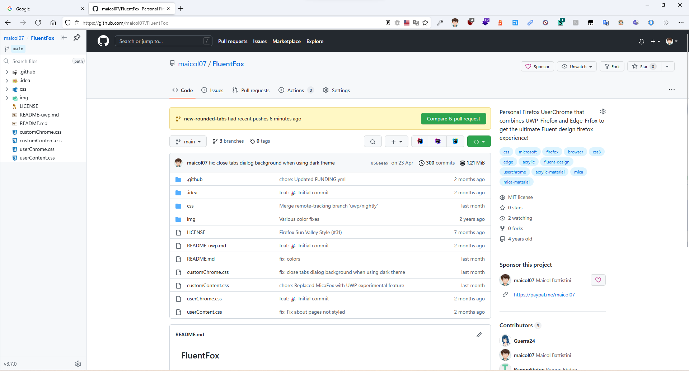

## FluentFox

The ultimate userChrome to get the ultimate Fluent Design experience on Firefox!

> DISCLAIMER! This is a personal project. The files and the code are provided AS IS and there is no warranty the code will work in future versions of FireFox if it won't be supported!

This project combines three other userChromes:

* [Firefox UWP style](https://github.com/Guerra24/Firefox-UWP-Style) - [README](README-uwp.md)
* [Edge-Frfox](https://github.com/bmFtZQ/Edge-FrFox)

## Installation

1. Go to `about:support` and click the "Open Folder/Show in Finder" button for the root directory of your browser profile/s.
2. Download and copy the `chrome` folder into the profile folder.
3. Go to about:config and change these preferences:
   - `toolkit.legacyUserProfileCustomizations.stylesheets` = `true`
   - `svg.context-properties.content.enabled` = `true`
   - `layout.css.color-mix.enabled`=`true`

To get the full result you should enable these features:

- [Windows 11 styles for controls](https://github.com/Guerra24/Firefox-UWP-Style#sun-valley)
- Toggle `layout.css.backdrop-filter.enabled` pref to enable *acrylic blur* in some menus.
- [Mica](https://github.com/Guerra24/Firefox-UWP-Style#mica-wip)
- Add `uc.tweak.disable-drag-space` pref to disable additional space above tabs

Currently only tested on latest Nightly and Developer Edition
